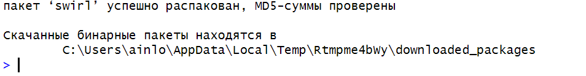
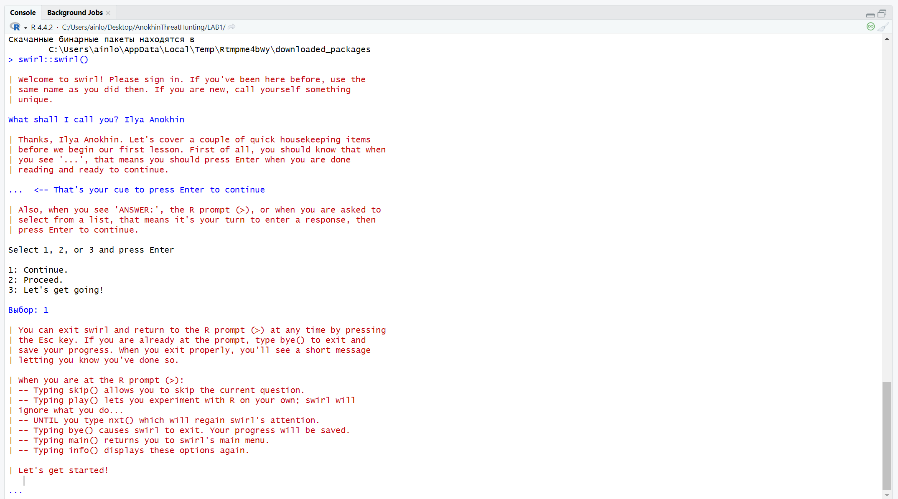

# Lab1 Anokhin Ilya


# Lab1

## Цель

1.  Развить практические навыки использования языка программирования R
    для обработки данных
2.  Развить навыки работы в Rstudio IDE
3.  Закрепить знания базовых типов данных языка R и простейших операций
    с ними

## Исходные данные

1.  Windows 11
2.  Rstudio
3.  Github

## План

1.  Установить программный пакет swirl
2.  Запустить задание с помощью swirl::swirl()
3.  Выбрать из меню курсов 1. R Programming: The basics of programming
    in R
4.  Составить отчет и выложить его и исходный qmd/rmd файл в свой
    репозиторий

### Шаг 1. Установка программного пакет swirl.



### Шаг 2. Запуск swirl и выбор обучения



### Шаг 3. Выполнение курсов

-   базовые структурные блоки (Basic Building Blocks)

``` r
5 + 7
```

    [1] 12

``` r
x <- 5 + 7
```

``` r
x
```

    [1] 12

``` r
y <- x - 3
```

``` r
y
```

    [1] 9

``` r
z <- c(1.1, 9, 3.14)
```

``` r
?c
```

    запускаю httpd сервер помощи... готово

``` r
z
```

    [1] 1.10 9.00 3.14

``` r
c(z,555, z)
```

    [1]   1.10   9.00   3.14 555.00   1.10   9.00   3.14

``` r
z * 2 + 100
```

    [1] 102.20 118.00 106.28

``` r
my_sqrt <- sqrt(z - 1)
```

``` r
my_sqrt
```

    [1] 0.3162278 2.8284271 1.4628739

``` r
 my_div <- z / my_sqrt
```

``` r
my_div
```

    [1] 3.478505 3.181981 2.146460

``` r
c(1, 2, 3, 4) + c(0, 10)
```

    [1]  1 12  3 14

``` r
c(1, 2, 3, 4) + c(0, 10, 100)
```

    Warning in c(1, 2, 3, 4) + c(0, 10, 100): длина большего объекта не является
    произведением длины меньшего объекта

    [1]   1  12 103   4

``` r
z * 2 + 1000
```

    [1] 1002.20 1018.00 1006.28

``` r
my_div
```

    [1] 3.478505 3.181981 2.146460

-   рабочие пространства и файлы (Workspace and Files)

``` r
getwd()
```

    [1] "C:/Users/ainlo/Desktop/AnokhinThreatHunting/LAB1"

``` r
ls()
```

    [1] "my_div"  "my_sqrt" "x"       "y"       "z"      

``` r
x <- 9
```

``` r
ls()
```

    [1] "my_div"  "my_sqrt" "x"       "y"       "z"      

``` r
dir()
```

    [1] "IMG"              "LAB1.Rproj"       "README.qmd"       "README.rmarkdown"

``` r
?list.files
```

``` r
args(list.files)
```

    function (path = ".", pattern = NULL, all.files = FALSE, full.names = FALSE, 
        recursive = FALSE, ignore.case = FALSE, include.dirs = FALSE, 
        no.. = FALSE) 
    NULL

``` r
old.dir <- getwd()
```

``` r
dir.create("testdir")
```

``` r
setwd("testdir")
```

``` r
file.create("mytest.R")
```

    [1] TRUE

``` r
ls()
```

    [1] "my_div"  "my_sqrt" "old.dir" "x"       "y"       "z"      

``` r
list.files()
```

    [1] "IMG"              "LAB1.Rproj"       "mytest.R"         "README.qmd"      
    [5] "README.rmarkdown" "testdir"         

``` r
file.exists("mytest.R")
```

    [1] TRUE

``` r
file.info("mytest.R")
```

             size isdir mode               mtime               ctime
    mytest.R    0 FALSE  666 2025-01-08 15:27:57 2025-01-08 15:27:57
                           atime exe
    mytest.R 2025-01-08 15:27:57  no

``` r
file.rename("mytest.R", "mytest2.R")
```

    [1] TRUE

``` r
file.copy("mytest2.R", "mytest3.R")
```

    [1] TRUE

``` r
file.path("mytest3.R")
```

    [1] "mytest3.R"

``` r
file.path("folder1", "folder2")
```

    [1] "folder1/folder2"

``` r
?dir.create
```

``` r
dir.create(file.path('testdir2', 'testdir3'), recursive = TRUE)
```

``` r
unlink('testdir2', recursive = TRUE)
```

``` r
setwd(old.dir)
```

-   последовательности чисел (Sequences of Numbers)

``` r
1:20
```

     [1]  1  2  3  4  5  6  7  8  9 10 11 12 13 14 15 16 17 18 19 20

``` r
pi:10
```

    [1] 3.141593 4.141593 5.141593 6.141593 7.141593 8.141593 9.141593

``` r
15:1
```

     [1] 15 14 13 12 11 10  9  8  7  6  5  4  3  2  1

``` r
?':'
```

``` r
seq(1,20)
```

     [1]  1  2  3  4  5  6  7  8  9 10 11 12 13 14 15 16 17 18 19 20

``` r
seq(0, 10, by=0.5)
```

     [1]  0.0  0.5  1.0  1.5  2.0  2.5  3.0  3.5  4.0  4.5  5.0  5.5  6.0  6.5  7.0
    [16]  7.5  8.0  8.5  9.0  9.5 10.0

``` r
my_seq <- seq(5, 10, length=30)
```

``` r
length(my_seq)
```

    [1] 30

``` r
1:length(my_seq)
```

     [1]  1  2  3  4  5  6  7  8  9 10 11 12 13 14 15 16 17 18 19 20 21 22 23 24 25
    [26] 26 27 28 29 30

``` r
seq(along.with = my_seq)
```

     [1]  1  2  3  4  5  6  7  8  9 10 11 12 13 14 15 16 17 18 19 20 21 22 23 24 25
    [26] 26 27 28 29 30

``` r
seq_along(my_seq)
```

     [1]  1  2  3  4  5  6  7  8  9 10 11 12 13 14 15 16 17 18 19 20 21 22 23 24 25
    [26] 26 27 28 29 30

``` r
rep(0, times=40)
```

     [1] 0 0 0 0 0 0 0 0 0 0 0 0 0 0 0 0 0 0 0 0 0 0 0 0 0 0 0 0 0 0 0 0 0 0 0 0 0 0
    [39] 0 0

``` r
rep(c(0, 1, 2), times = 10)
```

     [1] 0 1 2 0 1 2 0 1 2 0 1 2 0 1 2 0 1 2 0 1 2 0 1 2 0 1 2 0 1 2

``` r
rep(c(0, 1, 2), each = 10)
```

     [1] 0 0 0 0 0 0 0 0 0 0 1 1 1 1 1 1 1 1 1 1 2 2 2 2 2 2 2 2 2 2

-   векторы (Vectors)

``` r
num_vect <- c(0.5, 55, -10, 6)
```

``` r
tf <- (num_vect < 1)
```

``` r
tf <- num_vect < 1
```

``` r
tf
```

    [1]  TRUE FALSE  TRUE FALSE

``` r
num_vect >= 6
```

    [1] FALSE  TRUE FALSE  TRUE

``` r
my_char <- c("My", "name", "is")
```

``` r
my_char
```

    [1] "My"   "name" "is"  

``` r
paste(my_char, collapse = " ")
```

    [1] "My name is"

``` r
my_name <- c(my_char, "Johnny")
```

``` r
my_name
```

    [1] "My"     "name"   "is"     "Johnny"

``` r
paste(my_name, collapse = " ")
```

    [1] "My name is Johnny"

``` r
paste("Hello", "world!", sep = " ")
```

    [1] "Hello world!"

``` r
paste(1:3, c("X", "Y", "Z"), sep = "")
```

    [1] "1X" "2Y" "3Z"

``` r
paste(LETTERS, 1:4, sep = "-")
```

     [1] "A-1" "B-2" "C-3" "D-4" "E-1" "F-2" "G-3" "H-4" "I-1" "J-2" "K-3" "L-4"
    [13] "M-1" "N-2" "O-3" "P-4" "Q-1" "R-2" "S-3" "T-4" "U-1" "V-2" "W-3" "X-4"
    [25] "Y-1" "Z-2"

-   пропущенные значения (Missing Values)

``` r
x <- c(44, NA, 5, NA)
```

``` r
x * 3
```

    [1] 132  NA  15  NA

``` r
y <- rnorm(1000)
```

``` r
 z <- rep(NA, 1000)
```

``` r
my_data <- sample(c(y, z), 100)
```

``` r
my_na <- is.na(my_data)
```

``` r
my_na
```

      [1] FALSE  TRUE FALSE  TRUE FALSE FALSE FALSE FALSE FALSE  TRUE FALSE FALSE
     [13] FALSE FALSE FALSE  TRUE  TRUE FALSE  TRUE FALSE FALSE FALSE FALSE FALSE
     [25]  TRUE FALSE FALSE FALSE  TRUE  TRUE FALSE  TRUE  TRUE  TRUE FALSE  TRUE
     [37] FALSE  TRUE  TRUE FALSE FALSE  TRUE FALSE  TRUE FALSE FALSE FALSE FALSE
     [49]  TRUE FALSE FALSE  TRUE FALSE  TRUE FALSE  TRUE  TRUE  TRUE FALSE  TRUE
     [61] FALSE  TRUE FALSE FALSE  TRUE FALSE  TRUE FALSE  TRUE  TRUE FALSE FALSE
     [73]  TRUE FALSE FALSE  TRUE FALSE  TRUE  TRUE  TRUE  TRUE FALSE  TRUE FALSE
     [85]  TRUE FALSE  TRUE FALSE  TRUE  TRUE  TRUE FALSE FALSE FALSE  TRUE  TRUE
     [97]  TRUE  TRUE  TRUE FALSE

``` r
my_data == NA
```

      [1] NA NA NA NA NA NA NA NA NA NA NA NA NA NA NA NA NA NA NA NA NA NA NA NA NA
     [26] NA NA NA NA NA NA NA NA NA NA NA NA NA NA NA NA NA NA NA NA NA NA NA NA NA
     [51] NA NA NA NA NA NA NA NA NA NA NA NA NA NA NA NA NA NA NA NA NA NA NA NA NA
     [76] NA NA NA NA NA NA NA NA NA NA NA NA NA NA NA NA NA NA NA NA NA NA NA NA NA

``` r
sum(my_na)
```

    [1] 46

``` r
my_data
```

      [1] -0.11456254          NA  0.18812629          NA -0.95139545  2.27607792
      [7] -0.09057781 -0.89302970 -0.12296867          NA  0.70342865  0.31049441
     [13]  0.39008291 -1.11967069 -0.48209418          NA          NA -0.46831667
     [19]          NA -1.23591281  1.11646792  0.03203998 -1.81588775  1.17095846
     [25]          NA -0.03756812 -0.32891377 -1.06505332          NA          NA
     [31]  1.39162266          NA          NA          NA  1.39968845          NA
     [37]  0.37254461          NA          NA -0.58020861 -0.06825102          NA
     [43] -0.29581522          NA -0.41716181  0.67135916 -0.25556942  0.41553567
     [49]          NA  0.38212393 -1.73480874          NA  0.38561885          NA
     [55]  0.25327858          NA          NA          NA -0.38589797          NA
     [61]  1.18135066          NA  1.28642331 -1.48154813          NA  1.01469506
     [67]          NA  0.05733107          NA          NA -0.70182966 -0.42366501
     [73]          NA  0.33868973 -0.99336423          NA  0.32537525          NA
     [79]          NA          NA          NA -0.09099266          NA  0.14706912
     [85]          NA -1.29541513          NA -1.30259782          NA          NA
     [91]          NA -0.27847991 -0.75517459  2.25852459          NA          NA
     [97]          NA          NA          NA  1.53936918

``` r
0 / 0
```

    [1] NaN

``` r
Inf - Inf
```

    [1] NaN

## Оценка результата

В результате работы была установлена библиотека swirl, а также были
пройдены 5 подкурсов в рамках обучения “R Programming: The basics of
programming in R”

## Вывод

Были изучены базовые команды и функции языка R - работа с переменными,
векторами, файлами, циклами и NA.
